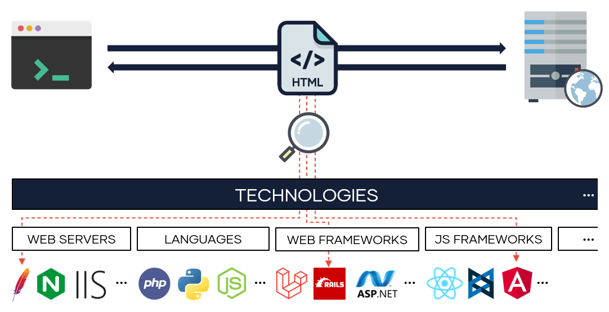

# wappy

[]() []()


A tool to discover technologies in web applications from your terminal. It uses the
[wap library](https://github.com/blackarrowsec/wap), that is a python implementation of the great 
[Wappalyzer](https://www.wappalyzer.com) browser extension. In fact, it uses 
the rules defined in the file 
[technologies.json](https://github.com/AliasIO/wappalyzer/blob/master/src/technologies.json) 
of the [Wappalyzer repository](https://github.com/AliasIO/wappalyzer).

<p align="center">
  
</p>


Note that results could not be exactly the same as the [Wappalyzer](https://www.wappalyzer.com) extension. This is because part of the information collected by wappy comes from the raw html, before being modified by javascript, as would be the case in a browser.

## Setup

To install from repo:
```shell
git clone https://github.com/blackarrowsec/wappy
cd wappy/
make install
```

To install dependencies:
```shell
git clone https://github.com/blackarrowsec/wappy
cd wappy/
make
python3 wappy.py -h
```

To update technologies.json file:
```shell
make uptechs
```


## Usage

As input, you should provide urls, and wappy will make a request and identify 
technologies based on the response.


To get technologies from url:
```shell
$ python3 wappy.py https://twitter.com
https://twitter.com/ Express
https://twitter.com/ Node.js
```

To get technologies from several urls you can provide a file or send 
urls for stdin:
```shell
$ cat urls.txt | python3 wappy.py
$ python3 wappy.py urls.txt
https://www.google.com/ Google Web Server
https://twitter.com/ Express
https://twitter.com/ Node.js
https://www.reddit.com/ Varnish
https://www.reddit.com/ Reddit
https://www.reddit.com/ Python
```

In json format:
```shell
$ python3 wappy.py urls.txt -j
[{"name": "Google Web Server", "url": "https://www.google.com/"}, {"name": "Express", "url": "https://twitter.com/"}, {"name": "Node.js", "url": "https://twitter.com/"}, {"name": "Reddit", "url": "https://www.reddit.com/"}, {"name": "Python", "url": "https://www.reddit.com/"}, {"name": "Varnish", "url": "https://www.reddit.com/"}]
```

Show version (`-b`), categories (`-k`) and confidence (`-c`) with `;` 
as delimiter (`-d`):
```shell
$ python3 wappy.py https://python.org -kbc -d ';'
https://www.python.org/;jQuery;1.8.2;100;JavaScript libraries
https://www.python.org/;Varnish;;100;Caching
https://www.python.org/;Modernizr;;100;JavaScript libraries
https://www.python.org/;Nginx;;100;Web servers,Reverse proxies
```

In json format:
```shell
$ python3 wappy.py https://python.org -kbc -j
[{"name": "Modernizr", "url": "https://www.python.org/", "version": "", "confidence": 100, "categories": ["JavaScript libraries"]}, {"name": "jQuery", "url": "https://www.python.org/", "version": "1.8.2", "confidence": 100, "categories": ["JavaScript libraries"]}, {"name": "Varnish", "url": "https://www.python.org/", "version": "", "confidence": 100, "categories": ["Caching"]}, {"name": "Nginx", "url": "https://www.python.org/", "version": "", "confidence": 100, "categories": ["Web servers", "Reverse proxies"]}]
```


## Adding new technologies

If you want that wappy detects a new technology, you can add your rules to the 
[technologies.json](https://github.com/AliasIO/wappalyzer/blob/master/src/technologies.json) 
file and load it with wappy. 

Please, consider to do a pull request to 
[Wappalyzer repo](https://github.com/AliasIO/wappalyzer)
and share your rules with the community. Follow the rules in 
[Adding a new technology](https://www.wappalyzer.com/docs/dev/contributing#adding-a-new-technology).

Please do not submit pull requests related to technologies.json, since this repository is 
not related with Wappalyzer.


## Author
Eloy Pérez ([@Zer1t0](https://github.com/Zer1t0)) [ [www.blackarrow.net](http://blackarrow.net/) - [www.tarlogic.com](https://www.tarlogic.com/en/) ]


## License
All the code included in this project is licensed under the terms of the GNU GPLv3 license.

#

[](https://www.blackarrow.net) [](https://twitter.com/BlackArrowSec) [](https://www.linkedin.com/company/blackarrowsec/)
